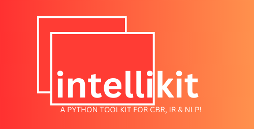

# Welcome to intellikit

**A python toolkit for case based reasoning, information retrieval, natural language processing and other techniques for AI and intelligent systems.**

**“intellikit” i.e. Intelligent Tool Kit** is a toolkit for **Case Based Reasoning** (CBR) and **Information Retrieval** (IR) in python. This package is being built primarily for educational purposes, and some content in it may be done more efficiently using Scikit-Learn and other libraries. In some instances such library functions are added directly in “intellikit” but feel free to test out those libraries concurrently and choose what suits your needs best. Some rare similarity measures are implemented from scratch in intellikit but you can extend the functions or implement your own functions depending on your needs. 

In case you need help getting started, the website for this library can be [accessed here!](https://ArthurKakande.github.io/intellikit) Multiple demo projects are added to the examples tab.

*If you are new to Case Based Reasoning and Information Retrieval entirely, here a simple refresher for you:*

**Case-Based Reasoning (CBR)** is a methodology for solving problems. These 
problems may be of a variety of natures. In principle, no problem type is excluded from 
being solved with the CBR methodology. The problem types range from exact sciences 
to mundane tasks. However, this does not mean that CBR is recommended for all problems.

Experiences are essential for CBR. In general, an experience is a recorded episode that occurred in the past, such as “Remember, last time a patient came in with similar symptoms, they had a particular infection” and such experiences are used to help solve future problems or make future decisions. Cases are experiences, they have a context and they also include problems and solutions. A case is explicitly represented/organized using case representations. These can be for example; 

-   **Feature-value pairs.** A feature value pair is used to represent a state of an entity, for example, colour of an entity, “Jessica’s car is red”, where the feature is the colour of the car and the value is red, and the entity is Jessica’s car.
-   **Textual case representation** (for this representation we consider elements of information retrieval)
-   **Object-oriented case representations**
-   **Graph-based case representations**

A key important aspect of CBR is similarity and retrieval. The purpose of retrieval is to retrieve the case from the case base (i.e., a candidate case) that is so similar to a given new problem that their solutions can be swapped. 

-   Free software: MIT License
-   Documentation: <https://ArthurKakande.github.io/intellikit>
    

## Feature_Value Pairs
  Simplest representation using key-value pairs to describe a case.
  
  Example: Diagnosing a car problem.
  Case: "Car won't start"
  Feature 1: Engine cranks (Yes/No) - Value: No
  Feature 2: Warning lights (List) - Value: Battery light
  New problem: "Engine makes a rattling noise" - Features and values are compared to diagnose the new issue.
  
  Use Cases: Simple diagnostic systems, configuration tasks, filtering products based on features.

## Textual case representation
  Uses natural language to describe a case, similar to a story.
  
  Example: Customer service incident reports.
  Case: "Customer reported their computer wouldn't connect to Wi-Fi. Tried restarting the router and device with no success."
  New problem: Another customer has a similar issue. The textual description helps identify the common cause and solution.
  
  Use Cases: Customer service, incident reports, where narratives provide context for problem-solving.

## Object-oriented case representation
  Cases are represented as objects with attributes, methods, and relationships.
  
  Example: Financial loan applications.
  Case: Loan application (Object)
  Attributes: Applicant name, income, loan amount, credit score.
  Methods: Calculate loan eligibility, determine interest rate.
  New problem: Another loan application is received. The object structure allows for easy comparison and reuse of past loan decisions based on applicant characteristics.
  
  Use Cases: Scenarios with well-defined objects and their interactions, financial analysis, design problems.

## Graph-based case representation
  Cases are represented as nodes (entities) and edges (relationships) in a graph structure.

  Example: Medical diagnosis.
  Case: Patient with a fever (Node) connected to symptoms (Nodes) like cough, sore throat. Edges represent relationships between symptoms.
  New problem: Another patient with similar symptoms. The graph allows for reasoning based on connections and identifying potential diagnoses by comparing symptom relationships.
  
  Use Cases: Medical diagnosis, network analysis, problems involving complex relationships between entities.

## Text/String Attributes Similarity
-   Hamming distance
-   Hamming Similarity (Normalized hamming distance)
-   Levenshtien distance
-   Levenshtien similarity (Normalized levenshtien distance)
-   Level similarity
-   N-grams
-   Cosine Similarity
-   Exact Match (Strings - Not case sensitive)

## Document Retrieval (Information Retrieval)
-   Vector space model (TF - IDF) 
-   Okapi BM25
-   Sentence Transformers

## Numeric Attribute Similarity
-   City block metric
-   Euclidean distance
-   Exact Match (Symmetric)
-   Log similarity
-   Asymmetric strategy with Case Higher 
-   Asymmetric strategy with Query Higher
-   Weighted euclidean distance

## Retrieval
-   Linear
-   ParallelLinear
-   MACFAC

## Upcoming Features that will be added in upcoming releases
-   A question answering module.
-   CBR similarity measures for taxonomies.
-   CBR measures and examples for Object oriented case representations and Graph based representations and Ontologies.

